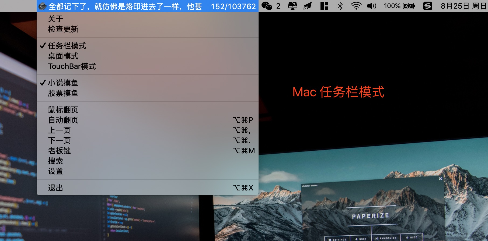
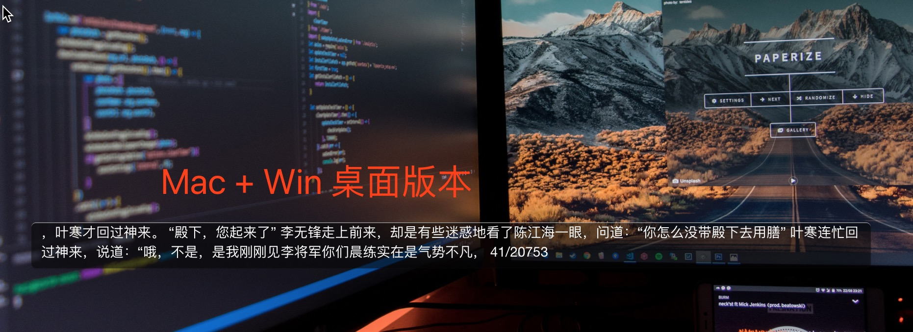
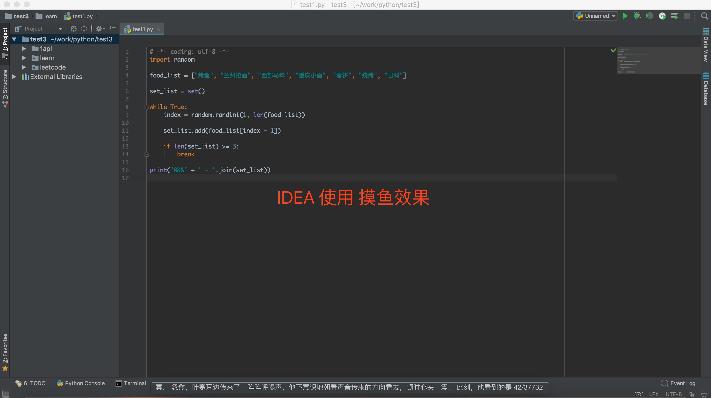
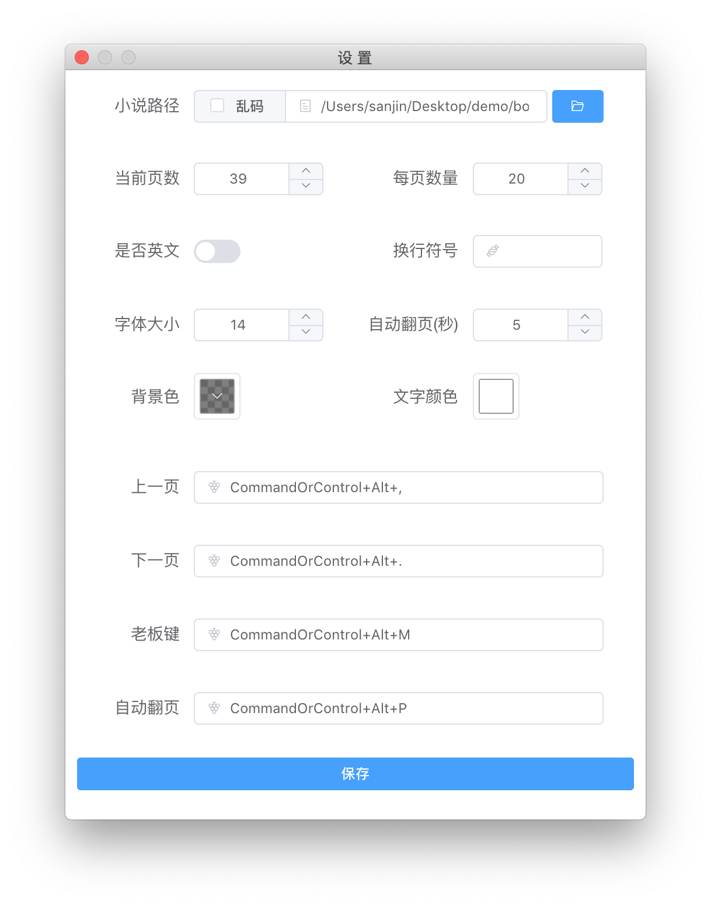

# 介绍

**Thief-Book** 是一款真正的`摸鱼神器`，可以更加隐秘性大胆的看小说。

- **隐蔽性** 自定义透明背景，随意调整大小，完美融入各种软件界面
- **快捷性** 三个快捷键，实现完美的摸鱼
- **跨平台** 支持 Mac+Win，Linux 暂未测试，请自行打包

# VScode

Thief-Book 为用户提供 Vscode 版本，具体请看 https://github.com/cteamx/Thief-Book-VSCode

# 下载地址

https://github.com/cteamx/Thief-Book/releases

# 版本区分

- MAC 支持 桌面版 + 任务栏版
- WIN 只有 桌面版

# 使用效果

Mac 任务栏版本，任务栏过多会自动隐藏

此版本可以随意拖拽，自定义大小，自定义背景颜色和文字颜色

idea 使用效果

设置界面

GBK 会出现乱码，请勾选乱码选项

## 动态演示

图片过大，加载太慢请访问URL查看

**Mac**

https://github.com/cteamx/Thief-Book/blob/master/images/mac.gif

**Win**

https://github.com/cteamx/Thief-Book/blob/master/images/win.gif

**鼠标模式**

切换鼠标模式，请先移动窗口到指定的位置(鼠标模式启动后不支持移动窗口)，按下一页启动鼠标模式。

鼠标左键下一页，右键上一页，鼠标移开自动隐藏

https://github.com/cteamx/Thief-Book/blob/master/images/mouse.gif

# 快捷键

## 默认按键

### MAC

<kbd>**Cmd+Option+M** </kbd> 老板键

<kbd>**Cmd+Option+,** </kbd>上一页

<kbd>**Cmd+Option+.**</kbd> 下一页 

### WIN

<kbd>**Ctrl+Alt+M** </kbd> 老板键

<kbd>**Ctrl+Alt+,** </kbd>上一页

<kbd>**Ctrl+Alt+.** </kbd>下一页 

## 自定义按键列表

**自定义后需重启**

> 快捷键可以包含多个功能键和一个键码的字符串，由符号+结合，用来定义你应用中的键盘快捷键

### 示例：

- CmdOrCtrl+A
- CmdOrCtrl+Shift+Z

> 在 Linux 和 Windows 上, Command 键没有任何效果, 所以使用 CommandOrControl表述, macOS 是 Command ，在 Linux 和 Windows 上是Control。
> 使用 Alt 代替Option. Option 键只在 macOS 系统上存在, 而 Alt 键在任何系统上都有效.
> Super键是指 Windows 和 Linux 系统上的 Windows 键，但在 macOS 里为 Cmd 键.

### 可用的功能键

- Command (缩写为Cmd)
- Control (缩写为Ctrl)
- CommandOrControl (缩写为 CmdOrCtrl)
- Alt
- Option
- AltGr
- Shift
- Super

### 可用的普通按键

- 0 to 9
- A to Z
- F1 to F24
- 类似~, !, @, #, $的标点符号
- Plus
- Space
- Tab
- 大写锁定（Capslock）
- 数字锁定（Numlock）
- Backspace
- Delete
- Insert
- Return (等同于 Enter)
- Up, Down, Left and Right
- Home 和 End
- PageUp 和 PageDown
- Escape (缩写为 Esc)
- VolumeUp, VolumeDown 和 VolumeMute
- MediaNextTrack、MediaPreviousTrack、MediaStop 和 MediaPlayPause
- PrintScreen

### 小键盘按键

- num1-num9 -数字1-数字9
- numdec - 小数点
- numadd - 加号
- numsub - 减号
- nummult - 乘号
- numdiv - 除号

# 异常汇总

## 乱码问题

如果乱码 设置->勾选乱码

or

转成 utf-8 格式

**Mac:** 浏览器打开->复制->存入到新的txt文本里

**Win:** 打开->另存为->选择utf-8->保存

## A JavaScript error occurred in the main process 

有可能是小说路径不对，保证小说路径正确即可

or

Json文件路径：C:\Users\Administrator\AppData\Roaming\thief-book

快捷键设置错打开会报错，找到 thief_data.json 没有就搜索 thief_data.json 修改里面的快捷键信息即可

or

把 thief_data.json 删掉， 删掉重启即可，当前页码会清空，请先记住页码在删除

# TODO

- [x] 任务栏版本
- [x] 桌面版本
- [x] 设置小说路径
- [x] 设置当前页数
- [x] 设置每页字数
- [x] 老板键
- [x] 上一页
- [x] 下一页
- [x] 英文小说支持
- [x] 自定义换行符号
- [x] 自定义桌面版背景
- [x] 自定义桌面版字体颜色
- [x] 跨平台兼容
- [x] 桌面版随意拖动，随意调整大小
- [x] 桌面版窗口永远顶置
- [x] 自定义文字大小
- [x] 自动翻页
- [x] 自定义快捷键
- [x] 支持 GBK
- [x] 鼠标模式
- [ ] 多本小说管理
- [ ] 在线小说下载
- [ ] 股票支持

## 关于

- 出品：C.TEAM
- E-mail：service@c.team

## 反馈群

加微信，备注拉人

