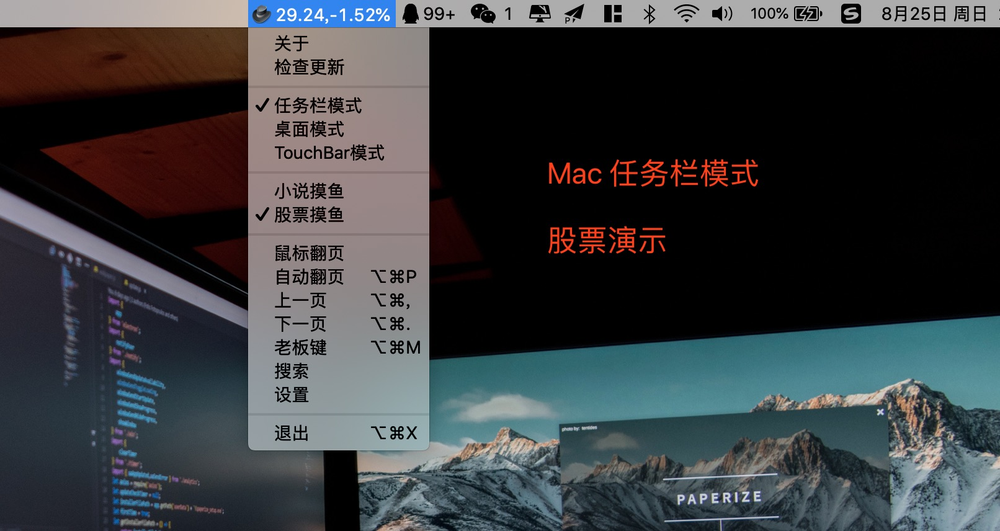
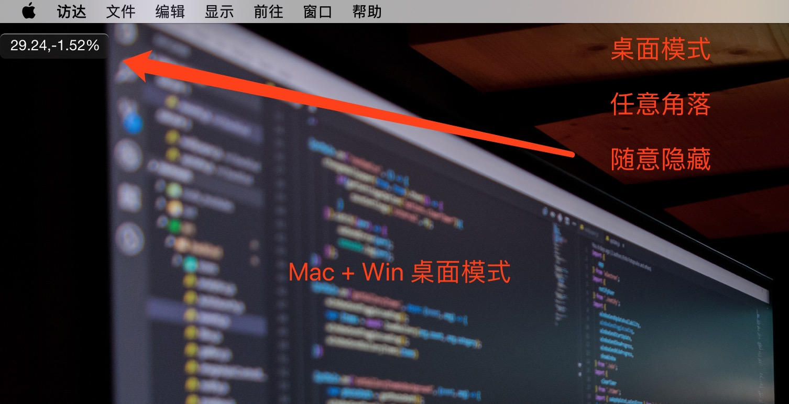

# 介绍

**Thief-Book** 是一款真正的最强`摸鱼神器`，可以更加隐秘性大胆的看小说，炒股。

- **隐蔽性** 自定义透明背景，随意调整大小，完美融入各种软件界面
- **快捷性** 三个快捷键，实现完美的摸鱼
- **跨平台** 支持 Mac+Win，Linux 暂未测试，请自行打包

# VScode

**Thief-Book** 为用户提供 **Vscode** 版本，具体请看 https://github.com/cteamx/Thief-Book-VSCode

# 下载地址

https://github.com/cteamx/Thief-Book/releases

# 版本区分

- **MAC** 支持 桌面模式 + 任务栏模式 + TouchBar 模式
- **WIN** 只有 桌面模式

# 使用效果

### Mac 任务栏模式

> 任务栏过多会自动隐藏

小说演示

股票演示

### Mac + Win 桌面模式

> 此版本可以随意拖拽，自定义大小，自定义背景颜色和文字颜色
>
> Mac 版本，支持 TouchBar 翻页 和 老板键

小说演示

股票演示

Mac TouchBar 按键

### Mac TouchBar 模式

> Mac 的朋友们有福了，这可以说是 Thief-Book 最强大的功能了
>
> 注意：必须获取内存框的焦点，才能使用 Touch Bar

### 实际使用效果

idea 编辑器 使用效果

### 设置界面

GBK 会出现乱码，请勾选乱码选项

## 动态演示

图片过大，加载太慢请访问URL查看

**Mac**

https://github.com/cteamx/Thief-Book/blob/master/images/mac.gif

**Win**

https://github.com/cteamx/Thief-Book/blob/master/images/win.gif

**鼠标模式**

切换鼠标模式，请先移动窗口到指定的位置(鼠标模式启动后不支持移动窗口)，按下一页启动鼠标模式。

鼠标左键下一页，右键上一页，鼠标移开自动隐藏

https://github.com/cteamx/Thief-Book/blob/master/images/mouse.gif

# 注意事项

- **股票** ( 5秒更新一次 ) , 显示格式为  `当前价格`,`跌涨百分比`

- **股票代码格式**，列：贵州茅台 ( 600519.SH ) ，设置里写 **sh600519**

- **TouchBar模式** 必须获取内存框的焦点，才能使用 **Touch Bar**

- **乱码问题** 勾选乱码选择框即可

- **WIN调整大小** 右键选大小，按一下键盘左右方向键调整大小
  

# 快捷键

## 默认按键

### MAC

<kbd>**Cmd+Option+M** </kbd> 老板键

<kbd>**Cmd+Option+,** </kbd>上一页

<kbd>**Cmd+Option+.**</kbd> 下一页 

### WIN

<kbd>**Ctrl+Alt+M** </kbd> 老板键

<kbd>**Ctrl+Alt+,** </kbd>上一页

<kbd>**Ctrl+Alt+.** </kbd>下一页 

## 自定义按键列表

**自定义后需重启**

> 快捷键可以包含多个功能键和一个键码的字符串，由符号+结合，用来定义你应用中的键盘快捷键

### 小键盘按键

> 小键盘无法自动识别，需要手动填写

- num1-num9 -数字1-数字9
- numdec - 小数点
- numadd - 加号
- numsub - 减号
- nummult - 乘号
- numdiv - 除号

# 异常汇总

## 乱码问题

如果乱码 设置->勾选乱码

or

转成 utf-8 格式

**Mac:** 浏览器打开->复制->存入到新的txt文本里

**Win:** 打开->另存为->选择utf-8->保存

## A JavaScript error occurred in the main process 

有可能是小说路径不对，保证小说路径正确即可

or

Json文件路径

Win: C:\Users\Administrator\AppData\Roaming\thief-book

快捷键设置错打开会报错，找到 thief_data.json 没有就搜索 thief_data.json 修改里面的快捷键信息即可

Mac：open -e ~/Library/Application\ Support/thief-book/thief_data.json （执行这个编辑即可）

or

把 thief_data.json 删掉， 删掉重启即可，当前页码会清空，请先记住页码在删除

# TODO

- [ ] 多本小说管理
- [ ] 在线小说下载

## 关于

- 出品：C.TEAM
- E-mail：service@c.team

## 反馈群

加微信，备注 摸鱼 拉人

